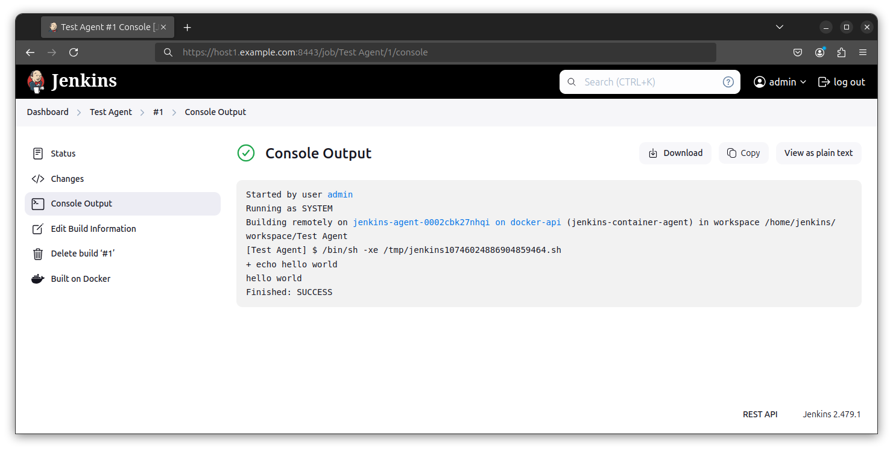
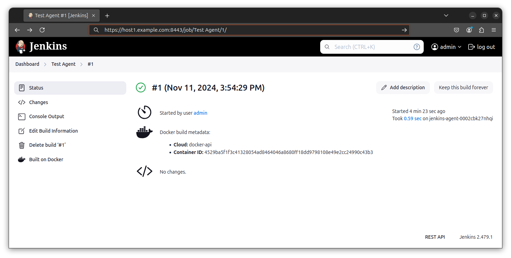
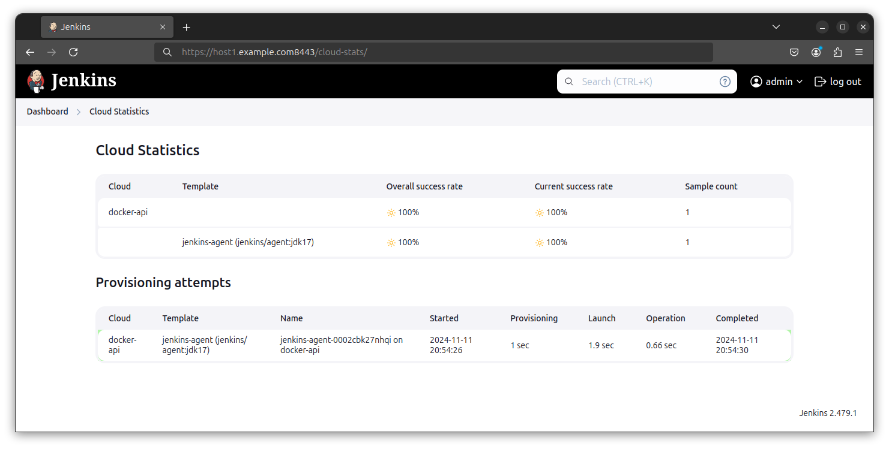

<!-- TOC -->

- [Description:](#description)
- [Using the script and configuration template](#using-the-script-and-configuration-template)
- [Example Script Run:](#example-script-run)
- [Jenkins Screenshots:](#jenkins-screenshots)
- [Basic Requirements:](#basic-requirements)
- [Warnings and Recommendations:](#warnings-and-recommendations)
- [File descriptions and usage:](#file-descriptions-and-usage)
- [Script General Workflow:](#script-general-workflow)
- [Credits, Future Improvements, Links, and TLDR;](#credits-future-improvements-links-and-tldr)

<!-- /TOC -->

# Description:
Example of running jenkins controller from a docker container running rootless, using docker API over TLS, creating a docker cloud in jenkins, and usng jenkins CASC (configuration as code).   There's lots of articles, gists, github repos etc that cover one area of running jenkins or another. The goal here was to put together an automated deployment end to end.  Therefore any changes are source controlled and trackable. 

This project uses jenkins casc (configuration as code) to configure the controller. Jenkins plugins, and credentials for connecting to the docker api as well as certificate and keystores are injected during the container build. The casc configuration includes set up of a docker cloud on the jenkins controller, and push a test job that will exercise running agents as containers.

The script will check requirements, configure, build, and run the container, generate all certs and embed into the containers as needed.  The script will also attempt to clean up resources, so be mindful of running it if you have stopped containers or unused volumes you wish to preserve.  (It will prompt before deleting dangling volumes or containers)

The script is opinionated, and assumes the following pre-requisite setup:
Docker running rootless as a local user, as well as docker to be accessible via API using TLS with self signed certs. Access to the CA cert, key and API cert are needed for building the container.  Docker Compose, Java, and some other utilities are also required. (Outlined in requirements section below)  

If all goes to plan (and you imported the CA cert you created into a browser, as well as updated the casc.yaml and setup.sh script), you should be able to access your jenkins controller via browser at https://[fqdn of your host]:8443 and you can run the sample job created.

# Using the script and configuration template warnings
Before running the setup.sh, there are a few manual edits to be made as they pertain to your environment if you do not want to supply a password for jenkins user, cacerts, or jenkins keystore on the cli. (ie. you dont want to supply -p, -k, -c to cli).  Either way you don't want to commit casc.yaml or jenkins-controller-docker-compose.env after a run (unless you made non credential based changes to the config). 

- casc.yaml
The jenkins admin user password should be changed, note that you will also need to update it in setup.sh
```
 users:
      - id: "admin"
        name: "admin"
        password: "jenkins"
```
- setup.sh
Update the auth portion of the curl command to coincide with what you used above in casc.yaml
```
-auth admin:jenkins
```
- jenkins-controller-docker-compose.env
```
--httpsKeyStorePassword=changeit
```

<details>

<summary>Example Script Run</summary>

#  Example Script Run:
```
name@host1:~/github/jenkins-docker-cloud-tls$ ./setup.sh -e -p examplepass -c examplecacertspw -k examplekeystorepw
--Function: parse_cli--
Option -e selected, will execute rather than dry-run !
Option -p selected, password for Jenkins application supplied !
Option -c selected, password for Jenkins cacerts supplied !
Option -k selected, password for Jenkins keystore supplied !
Options selected: -e -p -c -k 

--Function: check_binary_available--
docker is installed.
openssl is installed.
keytool is installed.
wget is installed.
java is installed.
curl is installed.
jq is installed.
yq is installed.

--Function: check_docker_rootless--
Docker rootless and containerd appears functional.

--Function: check_docker_api--
Docker API appears functional.
API response indicates rootless mode in use.
API response indicates connection to host1.example.com is good.

--Function: pull_latest_image--
Checking for available update for docker.io/jenkins/jenkins:lts-jdk17...
Local digest:  sha256:58550a76f7137eaa0e0e058be8f9ef2dc676b13ea4d1ad34b3bc62d808c3a235
Remote digest: sha256:58550a76f7137eaa0e0e058be8f9ef2dc676b13ea4d1ad34b3bc62d808c3a235
Already up to date. Nothing to do.

--Function: pull_latest_image--
Checking for available update for docker.io/jenkins/agent:jdk17...
Local digest:  sha256:137591449be45b1c6aba49342aafb4636d5be4120562ca9e6ac2bbddcc6e0cb5
Remote digest: sha256:137591449be45b1c6aba49342aafb4636d5be4120562ca9e6ac2bbddcc6e0cb5
Already up to date. Nothing to do.

--Function: clean_intermediate_files--
removed 'cacerts'
removed 'docker_api_root_ca.pem'
removed 'ca-cert.srl'
removed 'ca-key.pem'
removed 'server-req.pem'
removed 'server-key.pem'
removed 'server-ext.cnf'
removed 'server-cert.pem'
removed 'jenkins_keystore.jks'
removed 'jenkins.p12'
removed 'jenkins-cli.jar'

--Function: clean_docker_resources--
[+] Running 1/0
 ✔ Volume jenkins-home-1  Removed                                                                              0.0s 
Removing dangling images if they exist.
dangling images found: 
REPOSITORY   TAG       IMAGE ID       CREATED         SIZE
<none>       <none>    2afa11d95de1   8 minutes ago   561MB
Deleted Images:
deleted: sha256:2afa11d95de126f35acfe847541a7ad8892fcacbcc5c8645118f1da70b9e5426

Total reclaimed space: 0B
Remove unused volumes if they exist.
volumes found: 
9c76ab961cd117023922774894572b7dbe9ccb96704bf99a9498808657c1172b
ff631c21117866aad85cdfc775b9391072d615e9c7dc6e51a52e91b342c6c6e4
9c76ab961cd117023922774894572b7dbe9ccb96704bf99a9498808657c1172b
ff631c21117866aad85cdfc775b9391072d615e9c7dc6e51a52e91b342c6c6e4

--Function: generate_controller_cacerts--
Get CA cert from local docker API and verify it

--Function: check_certificate--
docker_api_root_ca.pem is good for at least 2 weeks.
docker_api_root_ca.pem CN matches hostname.
[+] Building 1.5s (5/5) FINISHED                                                                    docker:rootless
 => [internal] load build definition from DockerfileGetcacerts                                                 0.0s
 => => transferring dockerfile: 78B                                                                            0.0s
 => [internal] load metadata for docker.io/jenkins/jenkins:lts-jdk17                                           0.0s
 => [internal] load .dockerignore                                                                              0.0s
 => => transferring context: 2B                                                                                0.0s
 => CACHED [1/1] FROM docker.io/jenkins/jenkins:lts-jdk17                                                      0.0s
 => exporting to client directory                                                                              1.4s
 => => copying files 470.78MB                                                                                  1.4s
'jenkinsrootfs/opt/java/openjdk/lib/security/cacerts' -> 'cacerts'
Certificate was added to keystore
keytool import of ca cert pem into cacerts appears successful.
keytool lists Docker API CA alias in keystore cacerts as trusted entry.
Changing cacerts default password of changeit for security

--Function: generate_jenkins_app_certs_and_keystore--
generate CA
generate jenkins server priv key and csr
generate alt names file for cert
generate jenkins server cert

--Function: check_certificate--
server-cert.pem is good for at least 2 weeks.
server-cert.pem CN matches hostname.
Generated CA and cert passed verification.
generate jenkins keystore to hold self signed cert
Generating 4,096 bit RSA key pair and self-signed certificate (SHA384withRSA) with a validity of 365 days
	for: CN=jenkins, OU=host1, O=example.com, C=US
create pkcs12 file of server cert and key
import pkcs12 file to keystore
Importing keystore jenkins.p12 to jenkins_keystore.jks...
Entry for alias 1 successfully imported.
Import command completed:  1 entries successfully imported, 0 entries failed or cancelled
import server ca to keystore
Certificate was added to keystore
update docker compose env file to reflect jenkins keystore pw

--Function: update_jenkins_casc--
Update jenkins configuration as code (casc) yaml file from data collected in this script
User supplied password will be injected

--Function: build_container_and_run_stack--
Running docker compose and standing up app stack
[+] Building 10.9s (12/12) FINISHED                                                                 docker:rootless
 => [jenkins_controller internal] load build definition from JenkinsDockerfile                                 0.0s
 => => transferring dockerfile: 889B                                                                           0.0s
 => WARN: LegacyKeyValueFormat: "ENV key=value" should be used instead of legacy "ENV key value" format (line  0.0s
 => WARN: LegacyKeyValueFormat: "ENV key=value" should be used instead of legacy "ENV key value" format (line  0.0s
 => [jenkins_controller internal] load metadata for docker.io/jenkins/jenkins:lts-jdk17                        0.0s
 => [jenkins_controller internal] load .dockerignore                                                           0.0s
 => => transferring context: 2B                                                                                0.0s
 => CACHED [jenkins_controller 1/1] FROM docker.io/jenkins/jenkins:lts-jdk17                                   0.0s
 => [jenkins_controller internal] load build context                                                           0.0s
 => => transferring context: 203.31kB                                                                          0.0s
 => [jenkins_controller 2/6] COPY jenkins_keystore.jks /var/jenkins_home/jenkins_keystore.jks                  0.0s
 => [jenkins_controller 3/6] COPY cacerts /opt/java/openjdk/lib/security/cacerts                               0.0s
 => [jenkins_controller 4/6] COPY --chown=jenkins:jenkins ./plugins.txt /usr/share/jenkins/plugins.txt         0.1s
 => [jenkins_controller 5/6] RUN jenkins-plugin-cli -f /usr/share/jenkins/plugins.txt                         10.1s
 => [jenkins_controller 6/6] COPY casc.yaml /var/jenkins_home/casc.yaml                                        0.1s
 => [jenkins_controller] exporting to image                                                                    0.4s
 => => exporting layers                                                                                        0.4s
 => => writing image sha256:244858dbf83fda24b0e3959a2b32665109548cf101028cbab1ccb61ccb58b958                   0.0s
 => => naming to docker.io/jenkins/controller-casc                                                             0.0s
 => [jenkins_controller] resolving provenance for metadata file                                                0.0s
[+] Running 3/3
 ✔ Network jenkins-docker-cloud-tls_jenkins  Created                                                           0.1s 
 ✔ Volume "jenkins-home-1"                   Created                                                           0.0s 
 ✔ Container jenkins-controller-1            Started                                                           0.3s 
Verify container running post compose
container now running
Check jenkins app responding via curl
.........jenkins app now running

--Function: exercise_jenkins--
retrieving latest jenkins cli jar from app
uploading a container agent test job

```
</details>

<details>
<summary>Jenkins Screenshots</summary>

# Jenkins Screenshots:




</details>

# Basic Requirements:
- git ( not only needed to pull this project, but also to detect local changes during run)
- Docker Compose V2
- Docker Rootless configured and using TLS for API connections to the socket
- Ubuntu 24 (should work on other distros as well, albeit minor modifications may be required)
- python 3 with pip (required by docker compose)
- Java Open JDK installed (needed for keytool, and jenkins-cli). Other java installations likely ok.
- OpenSSL installed (needed for certificate and CA operations)
- Curl installed
- Wget installed
- jq installed (needed to parse and query json responses)
- Firefox or Chrome browser and understanding of how to import a CA into them. (examples in the links section)
- fqdn properly set for the host, and host resolvable by ip other than localhost
- yq installed (needed to programatically edit yaml files) 
- sed (needed to programatically edit env files)

# Warnings, Secrets, and Recommendations:
## Warnings
The secrets used for the jenkins admin user and keystore should also be changed prior to production use.
While the .gitignore file is in place, to prevent accidental storing of secrets and credentials, caution should be applied when modifying any templates to contain secrets so as to prevent accidental upload to git such as the yaml files or env files, which are not protected by .gitignore.

## Secrets
Secrets that are updated on the fly from the script if supplied (defaults will be used otherwise but not recommended):
1. cacerts keystore pw embedded in the container that allow Jenkins to trust your local Docker API self signed CA
2. jenkins admin user (allows login to the application in the browser as well as job upload and exercise)
3. jenkins java keystore (allows jenkins to serve https to the browser and trust it's own self signed CA)

## Recommendations
Commercially purchased and trusted certs are better. This example uses self signed for demonstration purposes only, in a production environment, it's recommended to use commercially purchased or domain generated certs that align with your environment. Frequent update of the container, and plugins is also recommended.


# File descriptions and usage:
| filename | description |
| ---------| ----------- |
| casc.yaml | jenkins casc configuration |       
| DockerfileGetcacerts | dockerfile used to get cacerts from exploded filesystem |
| jenkins-controller-docker-compose.env | env vars passed to docker compose |
| jenkins-controller-docker-compose.yaml | docker compose file for controller, volumes, network |
| JenkinsDockerfile | dockerfile used to build customized controller |
| plugins.txt | text listing of plugins and version used to preconfigure jenkins controller |
| setup.sh | bash script to perform basic checks, create CAs, certs, and keystores, and stand up containers |
| TestAgent.xml | sample job uploaded to exercise agent container |

# Script General Workflow:
While the shell script is commented, below is an overview of what it does.  

1. Basic check that binary pre-reqs at least exist (not an exhaustive check that they run, or installed properly)

2. Rudimentary check that docker is running rootless, and accessible via API using tls authenticaiton

3. Reasonable attempt to clean up from previous runs, such as deleting intermediate files and resetting the sandbox to clean. Check for newer versions of the controller and agent containers and pull them if they exist.

4. Pull a copy of the cacerts from the latest controller image, and inject our Docker API tls certs into the cacerts file so jenkins can communicate with docker via API.  This requires exploding the image to a filesystem, copying out the cacerts file, and deleting the intermediate exploded filesystem. Update cacerts pw from default.

5. Generate a CA, and self signed certs for jenkins controller to be able to be accessed by the browser using tls/https. It injects these into a keystore for consumption by Jenkins. The CA for jenkins will need to be manually imported into your browser to prevent untrusted certificate errors while accessing the application in the browser. Update keystore pw where described in other sections.

6.  Build the container from Dockerfile which will use the certs created in previous steps, install plugins necessary from a list, mount volumes, and configure the controller using Jenkins CASC to create an initial user, some basic creds, and minimal server configuration, and avoid using the install wizard.
The minimal jenkins configuration includes creating a credential to talk to docker via API, as well as setting up the docker cloud, and an agent configuration run from a separate container on the local docker cloud. Docker compose will then be called to stand up the container, volume, and network. Lastly there is a basic attempt at verifying the container is running, and that the jenkins application is up and responding.

7. We'll pull the latest jenkins-cli jar from the running application, and use it to upload a sample job. To run the job, log into the application via browser, which, when run, will dynamically spin a container running in docker as an agent and run a simple echo command, run in the agent container. At conclusion of the job, the agent container is stopped.

# Credits, Future Improvements, Links, and TLDR;

The purpose of this example was to create an starting foundation for deployment automation of jenkins casc, containerization, and using tls/https.  While every attempt was made to be aligned with security best practices, there is always room for improvement. While this should work out of the box with minimal changes, it's not expected that one would use it without customization. The expectation is that some modification would be made to secure, and operationalize this to meet your work environment, and this is merely a quickstart. Future versions will be more opinionated and likely force this. 

Credits:
Matthias Lohr for the image update check script, which was modified (handle architecture, and allow pull of non local images) and integrated directly. Here's the link to the original source:
https://gitlab.com/MatthiasLohr/omnibus-gitlab-management-scripts/-/blob/main/docker-image-update-check.sh?ref_type=heads


Planned Future improvements:
- More parameterization of secrets and inputs reducing the chance of storing secrets in source
- More thorough checks and balances, error detection and handling.
- Automate CA cert import into Chrome/Firefox
- Look at using let's encrypt or other certificate solutions
- Add lifecycle to the script: initial deploy, backup (before delete), re-deploy, update etc
- Expand to other distros besides ubuntu 23,24

Links:
1. https://hub.docker.com/r/jenkins/jenkins  ( Jenkins Controller Image used in this example )
2. https://hub.docker.com/r/jenkins/agent/   ( Jenkins Agent Image used in this example )
3. https://www.jenkins.io/doc/book/managing/casc/  ( Jenkins casc reference and documentation )
4. https://wiki.mozilla.org/CA/AddRootToFirefox   (Importing CA cert into firefox)
5. https://support.google.com/chrome/a/answer/3505249?hl=en  (Importing CA cert into chrome)
